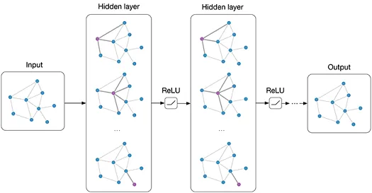
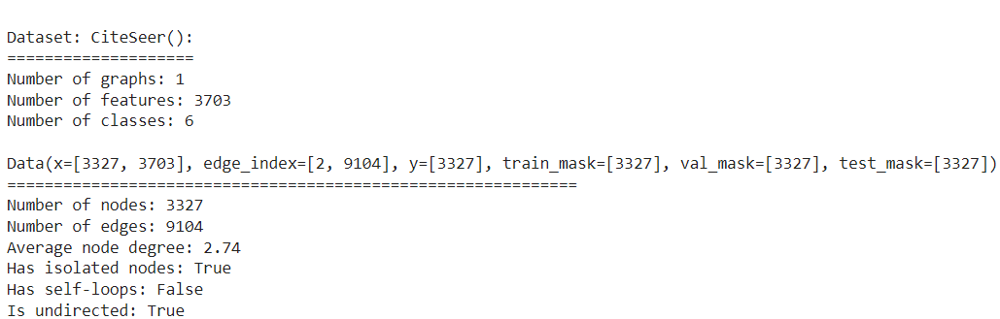
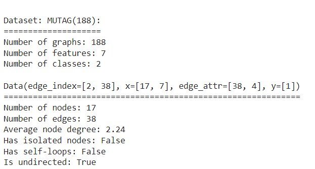

# Graf neuronske mreže

* [Uvod](#uvod)
* [Projekt](#Projekt)
* [Kod](#Kod)
  * [GCNNode](#gcnnode)
  * [GraphNode](#graphnode)
  * [GCNGraph](#gcngraph)
  * [GraphGraph](#graphgraph)
* [Tablice](#tablice)
  * [Tablica 1.](#tablica1)
  * [Tablica 2.](#tablica2)
  * [Tablica 3.](#tablica3)
  * [Tablica 4.](#tablica4)
## Uvod
Za početak ćemo definirati što je to zapravo graf. Grafovi su sveprisutna struktura podataka i univerzalni jezik za opisivanje
složenih sustava. Općenito, možemo reći da je to skup objekata, odnosno čvorova, zajedno s njihovim interakcijama, odnosno bridovima. Oni nude matematičku osnovu koju možemo nadograditi kako bi mogli analizirati, razumjeti te učiti iz složenih sustava stvarnog svijeta. U zadnjih dvadeset i pet
godina, došlo je do dramatičnog povećanja količine i kvalitete grafički strukturiranih podataka koji su dostupni istraživačima. Izazov je otključati potencijal tog mnoštva podataka. Kao što smo već spomenuli, graf $G = (V, E)$ je definiran skupom čvorova $V$ i skupom bridova $E$ između tih čvorova. Brid koji ide od čvora $u$ do čvora $v$ označavamo s $(u,v)$. Graf može imati usmjerene ili neusmjerene bridove. Prikladan način za predstavljanje grafova jest matrica susjedstva 
$`A \in \mathbb{R}<sup>(|V|*|V|)</sup>`$. Tada svaki čvor indeksira određeni redak i stupac u matrici susjedstva. Na taj način možemo prisutnost brida između 2 čvora predstaviti jedinicom, a odsutnost brida nulom. Odnosno, ako postoji brid između čvora $u$ i $v$ onda vrijedi $A[u,v] = 1$, a u protivnom vrijedi $A[u,v] = 0$.
## Projekt
Cilj ovog projekta je klasifikacija čvorova grafa te klasifikacija samog grafa korištenjem graf neuronskih mreža. U projektu je korištena biblioteka PyTorch Geometric. Implementirano je nekoliko modela čiji su rezultati prikazani u tablicama. U modelima smo koristili različite konvolucijske slojeve, te različite parametre (learning rate te weight decay), pri čemu smo dobivali različite rezultate ovisno o svim tim svojstvima.

## Kod
Za početak projekta smo prvo morali instalirati torch-geometric library te importati sve potrebne stvari koje će nam poslužiti prilikom stvaranja modela.

```python
!pip install torch-geometric
import torch
import torch.nn.functional as F

from torch_geometric.nn import GCNConv
from torch_geometric.nn import GraphConv
)
```

Prvo smo radili Node Classification u kojem smo učitali CiteSeer dataset. To je skup podataka koji se sastoji od 3312 znanstvenih publikacija razvrstanih u jednu od šest klasa. Citatnu mrežu čine 4732 poveznice. Svaka objava u skupu podataka opisana je vektorom riječi s vrijednosti 0/1 koji označava odsutnost/prisutnost odgovarajuće riječi iz rječnika. Rječnik se sastoji od 3703 jedinstvene riječi. 

```python
from torch_geometric.datasets import Planetoid

dataset = Planetoid(root='/tmp/CiteSeer', name='CiteSeer')
```
Nakon učitavanja skupa podataka smo još ispisali neke osnovne stvari koje su dio tog skupa.



Nakon tog smo krenuli u implementiranje prvog modela. Koristili smo GCNConv layer te ReLU kao aktivacijsku funkciju. Za ReLU vrijedi $ReLU(x)=max(x,0)$. Na kraju smo ispisali softmax distribuciju preko broja klasa.

### <ins> GCNNode <a class="anchor" id="gcnnode"></a></ins>


```python
class GCNNode(torch.nn.Module):
    def __init__(self):
        super().__init__()
        self.conv1 = GCNConv(dataset.num_node_features, 16)
        self.conv2 = GCNConv(16, dataset.num_classes)

    def forward(self, data):
        x, edge_index = data.x, data.edge_index

        x = self.conv1(x, edge_index)
        x = F.relu(x)
        x = F.dropout(x, training=self.training)
        x = self.conv2(x, edge_index)

        return F.log_softmax(x, dim=1)
```


Iza tog smo trenirali model na trening podacima za 11 epoha pri čemu smo mijenjali svojstva (learning_rate i weight_decay). Izračunali smo rezultate, a zatim ih i ispisali.


```python
device = torch.device('cuda' if torch.cuda.is_available() else 'cpu')
model = GCNNode().to(device)
print(model)
data = dataset[0].to(device)

learning_rates = [0.1,0.01,0.001,0.0001]
weight_decays = [0.1,0.01,0.001,0.0001]
for learning_rate in learning_rates:
  for weight_decay in weight_decays:
    optimizer = torch.optim.Adam(model.parameters(), lr=learning_rate, weight_decay = weight_decay)
    model.train()
    print(f'Learning_rate: {learning_rate}, weight_decay: {weight_decay}')
    print('=============================================================')
    print()
    for epoch in range(1, 12):
      optimizer.zero_grad()
      out = model(data)
      loss = F.nll_loss(out[data.train_mask], data.y[data.train_mask])
      loss.backward()
      optimizer.step()
      model.eval()
      pred = model(data).argmax(dim=1)
      correct = (pred[data.test_mask] == data.y[data.test_mask]).sum()
      test_acc = int(correct) / int(data.test_mask.sum())
      print(f'Epoch: {epoch:03d}, Test Acc: {test_acc:.4f}')
```

Nakon što smo završili s prvim modelom, napravili smo drugi u kom smo koristili GraphConv layer te kao u prošlom modelu ReLU aktivacijsku funkciju. Na kraju smo ispisali softmax distribuciju preko broja klasa.
### <ins> GraphNode <a class="anchor" id="graphnode"></a></ins>

```python
class GraphNode(torch.nn.Module):
    def __init__(self):
        super().__init__()
        self.conv1 = GraphConv(dataset.num_node_features, 16)
        self.conv2 = GraphConv(16, dataset.num_classes)

    def forward(self, data):
        x, edge_index = data.x, data.edge_index

        x = self.conv1(x, edge_index)
        x = F.relu(x)
        x = F.dropout(x, training=self.training)
        x = self.conv2(x, edge_index)

        return F.log_softmax(x, dim=1)
```

Treniranje modela, računanje i ispisivanje rezultata smo radili kao i u prošlom primjeru, ponovo za 11 epoha.

Nakon dva modela za Node Classification, napravili smo dva modela i za Graph Classification. Za početak smo učitali MUTAG dataset. Konkretno, MUTAG je zbirka nitroaromatskih spojeva i cilj je predvidjeti njihovu mutagenost na Salmonella typhimurium. Ulazni grafovi koriste se za predstavljanje kemijskih spojeva, gdje vrhovi predstavljaju atome i označeni su vrstom atoma, dok rubovi između vrhova predstavljaju veze između odgovarajućih atoma. Uključuje 188 uzoraka kemijskih spojeva sa 7 diskretnih oznaka čvorova.

```python
from torch_geometric.datasets import TUDataset

dataset = TUDataset(root='data/TUDataset', name='MUTAG')
```

Nakon učitavanja skupa podataka smo još ispisali neke osnovne stvari koje su dio tog skupa.



Zatim smo malo promiješali dataset te uzeli prvih 150 grafova kao trening grafove, a ostatak za testiranje.

```python
torch.manual_seed(12345)
dataset = dataset.shuffle()

train_dataset = dataset[:150]
test_dataset = dataset[150:]
```

Nakon tog smo iskoristili DataLoader koji nam nudi Pytorch Geometric kako bi grupirali manje grafove u jedan veliki graf kako bi imali punu iskoristivost GPU-a. Odlučili smo se da batch_size bude 64 te tako imamo 3 mini-batcha koji zajedno sadrže 150 grafova koje smo imali i na početku (64+64+22).

```python
from torch_geometric.loader import DataLoader

train_loader = DataLoader(train_dataset, batch_size=64, shuffle=True)
test_loader = DataLoader(test_dataset, batch_size=64, shuffle=False)
```

Onda smo krenuli implementirati prvi model za klasifikaciju grafa. U prvom modelu smo koristili GCNConv layer. Treniranje modela za klasifikaciju grafa obično ide na način da prvo ugradimo svaki čvor tako što napravimo više krugova prosljeđivanja poruka (tzv. message passing), nakon tog radimo ugrađivanje skupnih čvorova u ujedinjeno ugrađivanje grafa (tzv. readout layer), te na kraju treniramo završni klasifikator na ugrađivanju grafa.

U literaturi postoji više slojeva očitavanja (readout layera), ali najčešće uzimamo prosjek ugrađenih čvorova.

Svu ovu funkcionalnost Pytorch Geometric pruža kroz global_mean_pool funkciju koja uzima ugradnje svih čvorova iz mini-batcheva te batch vectore za izračunavanje ugradnje grafova za svaki graf u batchu. Opet koristimo ReLU aktivacijsku funkciju za dobivanje lokaliziranih ugrađivanja čvorova, a onda koristimo konačni klasifikator na vrhu sloja za očitavanje grafa.

### <ins> GCNGraph <a class="anchor" id="gcngraph"></a></ins>

```python
from torch.nn import Linear
from torch_geometric.nn import global_mean_pool


class GCNGraph(torch.nn.Module):
    def __init__(self, hidden_channels):
        super(GCNGraph, self).__init__()
        torch.manual_seed(12345)
        self.conv1 = GCNConv(dataset.num_node_features, hidden_channels)
        self.conv2 = GCNConv(hidden_channels, hidden_channels)
        self.conv3 = GCNConv(hidden_channels, hidden_channels)
        self.lin = Linear(hidden_channels, dataset.num_classes)

    def forward(self, x, edge_index, batch):

        x = self.conv1(x, edge_index)
        x = x.relu()
        x = self.conv2(x, edge_index)
        x = x.relu()
        x = self.conv3(x, edge_index)

        x = global_mean_pool(x, batch)

        x = F.dropout(x, p=0.5, training=self.training)
        x = self.lin(x)

        return x
```

Sada stvaramo model, te implementiramo funkcije za treniranje i testiranje.

```python
model = GCNGraph(hidden_channels=64)
optimizer = torch.optim.Adam(model.parameters(), lr=0.01)
criterion = torch.nn.CrossEntropyLoss()

def train():
    model.train()

    for data in train_loader:
         out = model(data.x, data.edge_index, data.batch)
         loss = criterion(out, data.y)
         loss.backward()
         optimizer.step()
         optimizer.zero_grad()

def test(loader):
     model.eval()

     correct = 0
     for data in loader:
         out = model(data.x, data.edge_index, data.batch)
         pred = out.argmax(dim=1)
         correct += int((pred == data.y).sum())
     return correct / len(loader.dataset)
```

Nakon tog nam naravno ostaje samo izračunati kvalitetu modela za različite parametre, te ispisati rezultate.

```python
learning_rates = [0.1,0.01,0.001,0.0001]
weight_decays = [0.1,0.01,0.001,0.0001]
for learning_rate in learning_rates:
  for weight_decay in weight_decays:
    optimizer = torch.optim.Adam(model.parameters(), lr=learning_rate, weight_decay = weight_decay)
    print(f'Learning_rate: {learning_rate}, weight_decay: {weight_decay}')
    print('=============================================================')
    print()
    for epoch in range(1, 12):
      train()
      train_acc = test(train_loader)
      test_acc = test(test_loader)
      print(f'Epoch: {epoch:03d}, Train Acc: {train_acc:.4f}, Test Acc: {test_acc:.4f}')
```

Nakon što smo završili s prvim modelom, napravili smo drugi u kom smo koristili GraphConv layer te kao u prošlom modelu ReLU aktivacijsku funkciju, a onda koristimo konačni klasifikator na vrhu sloja za očitavanje grafa.

### <ins> GraphGraph <a class="anchor" id="graphgraph"></a></ins>


```python
class GraphGraph(torch.nn.Module):
    def __init__(self, hidden_channels):
        super(GraphGraph, self).__init__()
        torch.manual_seed(12345)
        self.conv1 = GraphConv(dataset.num_node_features, hidden_channels)
        self.conv2 = GraphConv(hidden_channels, hidden_channels)
        self.conv3 = GraphConv(hidden_channels, hidden_channels)
        self.lin = Linear(hidden_channels, dataset.num_classes)

    def forward(self, x, edge_index, batch):
        x = self.conv1(x, edge_index)
        x = x.relu()
        x = self.conv2(x, edge_index)
        x = x.relu()
        x = self.conv3(x, edge_index)

        x = global_mean_pool(x, batch)

        x = F.dropout(x, p=0.5, training=self.training)
        x = self.lin(x)

        return x
```

Treniranje modela, računanje i ispisivanje rezultata smo radili kao i u prošlom primjeru, ponovo za 22 epohe.
U nastavku se mogu vidjeti rezultati svih ovih modela na skupovima podataka koje smo koristili.

## Tablice
### <ins>Tablica 1. <a class="anchor" id="tablica1"></a></ins> 
## GCNConv za klasifikaciju čvorova s obzirom na različite hiperparametre (11 epoha)
| *Learning rate*   | *Weight decay*   | *Accuracy* |
| -------------   | ------   | -------- |
| 0.1             | 0.1      | 0.7250   |
| 0.1             | 0.01      | 0.6910   |
| 0.1             | 0.001      | 0.5740   |
| 0.1             | 0.0001      | 0.6230   |
| 0.01            | 0.1      | 0.5650   |
| 0.01            | 0.01      | 0.6140   |
| 0.01            | 0.001      | 0.6620   |
| 0.01            | 0.0001      | 0.6670   |
| 0.001            | 0.1      | 0.6670   |
| 0.001            | 0.01      | 0.6650   |
| 0.001            | 0.001      | 0.6750   |
| 0.001            | 0.0001      | 0.6760   |
| 0.0001            | 0.1      | 0.6770   |
| 0.0001            | 0.01      | 0.6780   |
| 0.0001            | 0.001      | 0.6780   |
| 0.0001            | 0.0001      | 0.6780   |

### <ins>Tablica 2. <a class="anchor" id="tablica2"></a></ins> 
## GraphConv za klasifikaciju čvorova s obzirom na različite hiperparametre (11 epoha)
| *Learning rate*   | *Weight decay*   | *Accuracy* |
| -------------   | ------   | -------- |
| 0.1             | 0.1      | 0.4680   |
| 0.1             | 0.01      | 0.4020   |
| 0.1             | 0.001      | 0.4790   |
| 0.1             | 0.0001      | 0.5330   |
| 0.01            | 0.1      | 0.5410   |
| 0.01            | 0.01      | 0.5490   |
| 0.01            | 0.001      | 0.5720   |
| 0.01            | 0.0001      | 0.6330   |
| 0.001            | 0.1      | 0.6300  |
| 0.001            | 0.01      | 0.6290   |
| 0.001            | 0.001      | 0.6320   |
| 0.001            | 0.0001      | 0.6330   |
| 0.0001            | 0.1      | 0.6320   |
| 0.0001            | 0.01      | 0.6310   |
| 0.0001            | 0.001      | 0.6290   |
| 0.0001            | 0.0001      | 0.6340   |

### <ins>Tablica 3. <a class="anchor" id="tablica3"></a></ins>
## GCNConv za klasifikaciju grafa s obzirom na različite hiperparametre (22 epohe)
| *Learning rate*   | *Weight decay*   | *Accuracy* |
| -------------   | ------   | -------- |
| 0.1             | 0.1      | 0.7368   |
| 0.1             | 0.01      | 0.7368   |
| 0.1             | 0.001      | 0.8684   |
| 0.1             | 0.0001      | 0.7368   |
| 0.01            | 0.1      | 0.7368   |
| 0.01            | 0.01      | 0.8684   |
| 0.01            | 0.001      | 0.8684   |
| 0.01            | 0.0001      | 0.8421   |
| 0.001            | 0.1      | 0.8158  |
| 0.001            | 0.01      | 0.8421   |
| 0.001            | 0.001      | 0.8684   |
| 0.001            | 0.0001      | 0.7895   |
| 0.0001            | 0.1      | 0.7895   |
| 0.0001            | 0.01      | 0.7895   |
| 0.0001            | 0.001      | 0.7895   |
| 0.0001            | 0.0001      | 0.7895   |

### <ins>Tablica 4. <a class="anchor" id="tablica4"></a></ins> 
## GraphConv za klasifikaciju grafa s obzirom na različite hiperparametre (22 epohe)
| *Learning rate*   | *Weight decay*   | *Accuracy* |
| -------------   | ------   | -------- |
| 0.1             | 0.1      | 0.7368   |
| 0.1             | 0.01      | 0.7368   |
| 0.1             | 0.001      | 0.7368   |
| 0.1             | 0.0001      | 0.7368   |
| 0.01            | 0.1      | 0.7368   |
| 0.01            | 0.01      | 0.7368   |
| 0.01            | 0.001      | 0.7368   |
| 0.01            | 0.0001      | 0.8158   |
| 0.001            | 0.1      | 0.7895  |
| 0.001            | 0.01      | 0.7895   |
| 0.001            | 0.001      | 0.7895   |
| 0.001            | 0.0001      | 0.7895   |
| 0.0001            | 0.1      | 0.7895   |
| 0.0001            | 0.01      | 0.7895   |
| 0.0001            | 0.001      | 0.7895   |
| 0.0001            | 0.0001      | 0.7895   |

